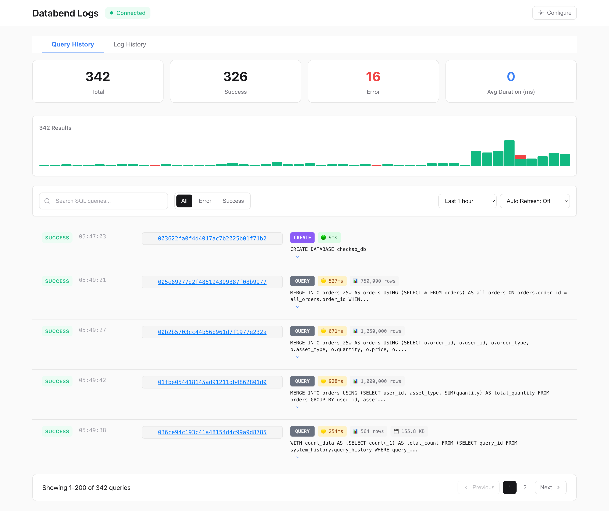

# BendDash

A lightweight, intuitive log observer for Databend databases.

## Features

- **Real-time Log Monitoring** with auto-refresh options (5s to 1h)
- **Advanced Filtering** by time range, log level, and search terms
- **Interactive Dashboard** with error statistics and query metrics
- **Detailed Log Analysis** with expandable message content
- **Custom SQL Queries** for advanced data exploration

## Quick Start

```bash
# Install
pip install -r requirements.txt

configure DSN through web interface
python start.py --port 5000

# Access web interface
open http://localhost:5000
```

## Configuration Options

- **DSN**: Configure through web UI or command line
- **Port**: Customize with `--port` (default: 5000)
- **Time Range**: Select from 5m to 2d views
- **Auto-refresh**: Choose intervals from 5s to 1h

## Screenshots



---

Made with ❤️ for Databend users
